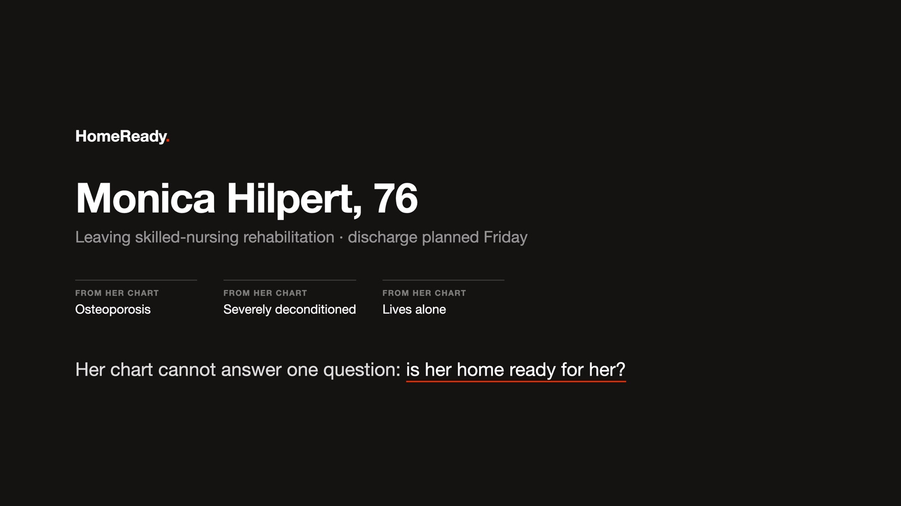
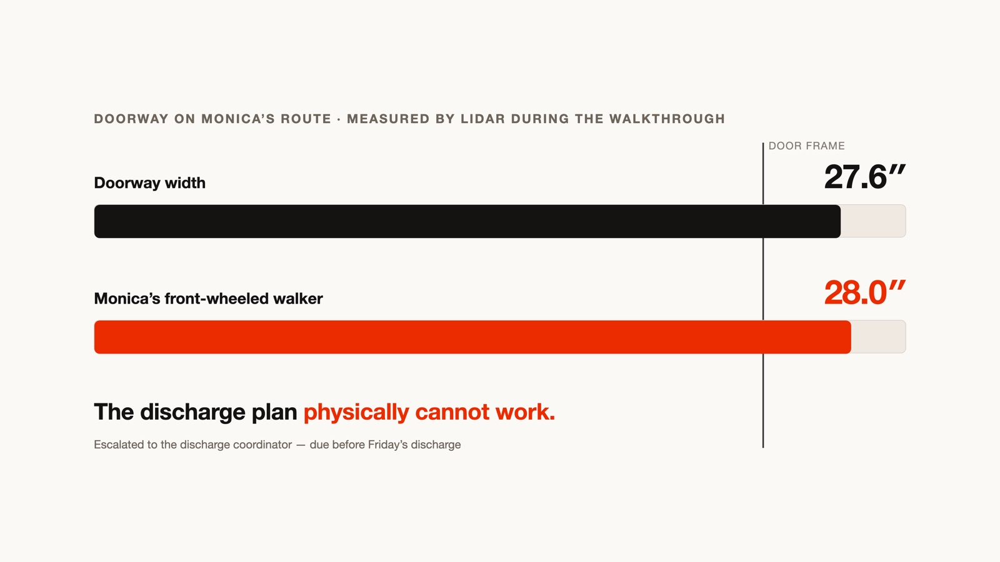
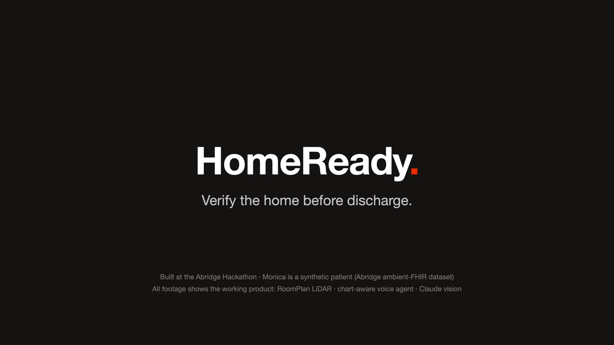

# HomeReady — verify the home before discharge



> *Monica's clinical team believes she may be ready to go home. HomeReady answers
> the question her chart cannot: **is her home ready for her?***

Built solo in one day at the **Abridge Hackathon** (July 18, 2026, Shack15 SF).

Every discharge plan ends with some version of *"discharge home once safe"* — but
nobody can verify "safe" from the chart. Falls after discharge are a leading
driver of readmissions; home-safety evaluations (CDC STEADI, HSSAT) exist but
need a clinician home visit that rarely happens. HomeReady turns any caregiver
with a LiDAR iPad into that visit, run by an agent — and closes the loop back
into the chart before the patient leaves.

## The demo story (chart → home → chart)

1. **Clinician portal** — Monica Hilpert, 76F (synthetic, from Abridge's
   `synthetic-ambient-fhir-25` dataset): osteoporosis, deconditioned after a
   week in hospital + SNF rehab, lives alone, uses a 28-inch walker, going home
   Friday. Her encounter note's discharge-planning line is highlighted — *"formal
   pre-discharge assessment of … home setup"* — and handed to HomeReady.
2. **Patient side** — Monica gets a message from **Riley**, the voice agent on
   her care team. Anyone at her home starts the walkthrough on any compatible
   device.
3. **The walkthrough** — full-duplex voice (Riley guides room to room, in
   *gathering mode*: neutral questions only, no hazard talk to laypeople), while
   three perception layers run: RoomPlan LiDAR (rooms, doorways, furniture — and
   live AR boxes on screen with YOLOv3 on the Neural Engine), a Claude Haiku
   fast-pass per camera frame (~1.3s) feeding Riley live scan events, and a
   Claude Sonnet deep-pass grading STEADI/HSSAT findings in the background.
   On-screen confirmation cards resolve by tap **or voice**.
4. **The verdict** — HomeReady scores every obligation it derived from the
   encounter note against walkthrough evidence. The killer finding is a
   measurement, not a vibe: **"The bathroom doorway is 27.6 in. Monica's walker
   is 28. The discharge plan as written will not work."**

   
5. **Care-team review** — a split-view station: drafted actions (clinical /
   operational / DME, each with owner + deadline + evidence) awaiting clinician
   approval, floor plans with the failing door drawn in red, the photo evidence
   filmstrip, and the full graded report. Approve → remediation verified →
   **chart updates: "VERIFIED, cleared for discharge."**

Nothing downstream of the camera is faked: every model call in the demo happens
live. There is deliberately **no fabricated risk score** anywhere — findings are
graded against CDC STEADI / HSSAT items with per-patient rationale, and all
orders/escalations are **drafted, never auto-sent**.

## Architecture

```
iPad (dumb client)                        Mac backend (all intelligence)
┌────────────────────────────┐           ┌────────────────────────────────────┐
│ RoomPlan LiDAR scan        │─ geometry ▶ /roomplan  walker-clearance math,  │
│  + live AR detection boxes │           │            floor-plan rendering    │
│ ARSession frames (2.5s)    │─ JPEG ────▶ /frame     Haiku fast-pass ──┐     │
│ ElevenLabs voice (WebRTC)  │           │            Sonnet deep-pass  │     │
│ confirmation cards         │           │  events + measurements ◀─────┘     │
└──────────┬─────────────────┘           │      ▼                             │
           │                             │ /v1/chat/completions  (SSE brain)  │
  ElevenLabs cloud ─ custom LLM ────────▶│ obligations engine ◀─ encounter    │
           (via ngrok)                   │ escalation router     note + AVS   │
                                         │ /report · /approvals · FHIR drafts │
                                         └────────────────────────────────────┘
```

- **One brain**: the ElevenLabs agent's LLM *is* this backend — the same model
  that sees the camera events and the chart writes Riley's next sentence.
- **Obligations engine**: derives post-encounter obligations from the encounter
  note + after-visit summary (the Abridge artifacts), then scores each
  `verified / at_risk / blocked / unverified` against walkthrough evidence.
- **Escalation router**: deterministic rules → routed messages (expected /
  observed / why / attempted / next action + owner + deadline).
- **FHIR write-back (draft)**: Observations (hazards), ServiceRequests (DME with
  HCPCS + Medicare coverage flags), Tasks (escalations), all tagged
  `DRAFT — requires clinician review`.

**Abridge captures the encounter. HomeReady verifies the home.**

## Run it

```bash
# backend (Mac)
python3 -m venv .venv && .venv/bin/pip install -r backend/requirements.txt
cp .env.example .env          # add ANTHROPIC_API_KEY (+ ELEVENLABS_API_KEY)
cd backend && ../.venv/bin/uvicorn app:app --host 0.0.0.0 --port 8000

# voice plumbing: ngrok http 8000, then point an ElevenLabs conversational
# agent's custom-LLM URL at https://<ngrok>/v1  (SSE streaming)

# iPad app (iPad Pro with LiDAR)
cd ipad && ./fetch-models.sh   # on-device YOLOv3 (59 MB, not committed)
xcodegen generate && open Walkthrough.xcodeproj

# demo mode (no home needed): feed any walkthrough video through the real
# pipeline — backend/prepare_demo.py <video>, then "replay" in the app
```

Care-team surfaces: `http://<mac>:8000/` (run index), `/report`, `/report/fhir`.

## Built with

Claude (Haiku 4.5 fast-pass · Sonnet 5 deep-pass + voice brain) · Apple RoomPlan
& Core ML (YOLOv3) · ElevenLabs Conversational AI · FastAPI · FHIR R4 · CDC
STEADI / HSSAT · Abridge `synthetic-ambient-fhir-25` dataset.

Synthetic data only — not a medical device. All patient data in this repo and
demo is fully synthetic (Synthea).


